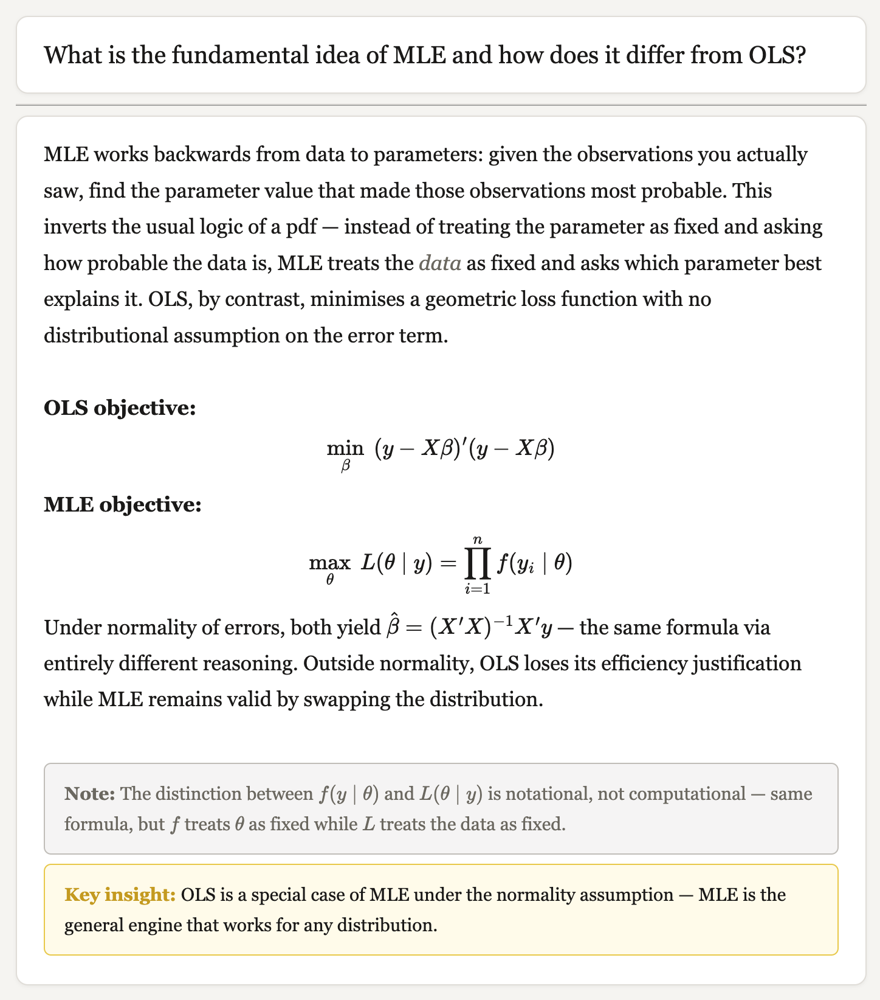
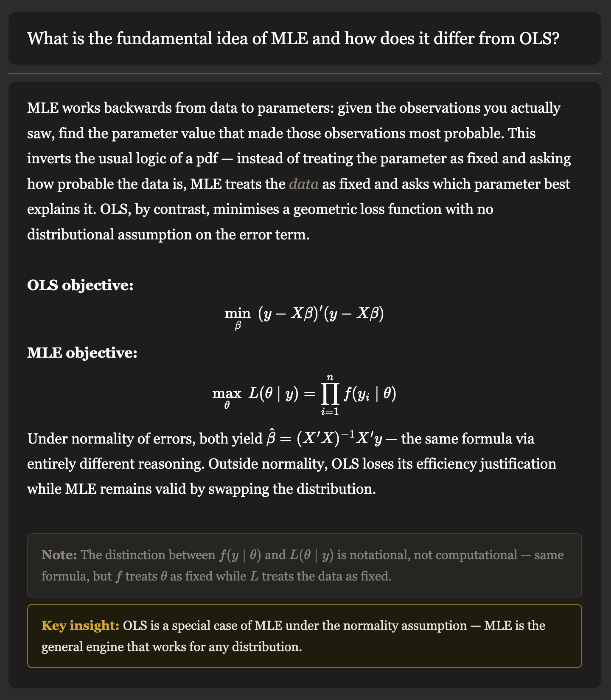

# Anki Card Template

A minimal, typographically considered Anki card template for graduate-level study. Designed for content-heavy decks in economics, mathematics, and related fields — with full MathJax support, dark mode, and a clean two-tier callout system.

## Features

- **Dark mode** — follows system preference via `prefers-color-scheme`, with a manual Anki nightmode fallback
- **MathJax ready** — display and inline equations render without spacing artifacts
- **Two callout tags** — `<insight>` for key unifying results, `<note>` for secondary relationships and cross-references
- **Category tag** — lightweight deck labelling via the `{{Category}}` field
- **Empty field suppression** — blank Context or Back fields collapse automatically

## Screenshots




## Installation

1. In Anki, open the card type editor: **Tools → Manage Note Types → Cards**
2. Paste the contents of `front.html` into the **Front Template** field
3. Paste the contents of `back.html` into the **Back Template** field
4. Paste the contents of `style.css` into the **Styling** field

## Callout usage

Two custom HTML tags are available in card Back fields:

```html
<insight>MLE is the general engine — OLS is a special case under normality.</insight>

<note>Compare with the unbiased estimator, which divides by n − K instead.</note>
```

`<insight>` is for the single most important takeaway on a card — a result that connects major ideas or reframes the topic. `<note>` is for useful secondary relationships, terminological distinctions, or cross-references. Use both sparingly; one per card at most.

## Card generation

The file `prompt.md` contains a ready-to-use LLM prompt for generating new cards in the correct HTML format, with proper MathJax syntax and callout usage instructions. Fill in the subject, topic, number of cards, and language at the top before use.